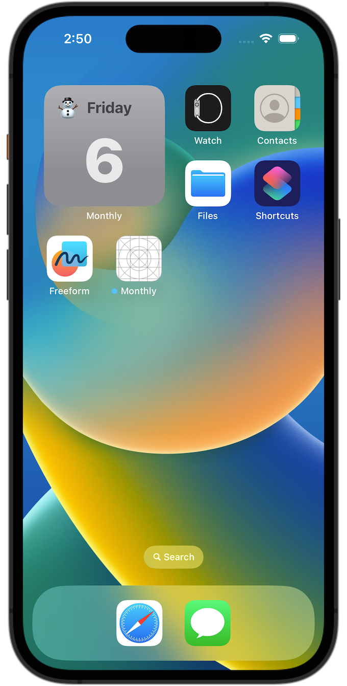

<h1 align=center>Monthly Theme Widget</h1>

    
    
    
    
    
    
    
    

A small project to learn the fundamentals of how to create a simple Widget with an intent and configuration for iOS 17+.

---

## Contents
* [Functionality](#functionality)
* [Tech Stack](#tech-stack)
* [Frameworks](#frameworks)
* [Device Compatibility](#device-compatibility)
* [Screenshots](#screenshots)
* [Learnings](#learnings)
* [Code Comments](#code-comments)
* [Pull Requests](#pull-requests)
* [Credits](#credits)

---

## Functionality
A simple Date Widget that changes the day at midnight and its theme every month. With iOS17+ it is also available in the [StandBy mode](https://support.apple.com/en-gb/guide/iphone/iph878d77632/ios).

## Tech Stack
- Xcode 15.0
- Swift 5.9

## Frameworks
- SwiftUI
- WidgetKit

## Device Compatibility
- iPhone with iOS 17+
- iPad with iOS 17+

## Screenshots
| Widget Normal Font | Intent |
| :---: | :---: |
|  |  |

| Configuration | Widget Fun Font |
| :---: | :---: |
|  |  |

| Different Days Overview |
| :---: |
|  |

## Learnings
- A Widget comes in 4 "fixed" sizes: systemSmall, systemMedium, systemLarge, systemExtraLarge
- The shape of a Widget is given
- The content of a widget can only be implemented with SwiftUI (no UIKit)
- The IntentTimelineProvider creates the timeline of the widget when to update its content:
    - placehoder: dummy data (in case there is no data from the snapshot eg. network call needed)
    - getSnapshot: how does the widget look right now (this state is shown in the widget gallery)
    - getTimeline: this is where the timeline actually gets created. It consists of an Array of entries (the data)
### Fonts
- [Best Free Fonts for iOS app](https://sarunw.com/posts/free-fonts-ios/)
- [List all fonts available on iOS device in console](https://gist.github.com/simonbromberg/24a48fb5e94b2bde82df1e5c97e733da)
- [Old list of iOS fonts](http://iosfonts.com/)
### Widget Intent & Configuration
- 1. Create a intent definition file add some intents with parameters
- 2. Add the IntentConfiguration to the Widget, which then takes in a IntentTimelineProvider

## Code Comments
I love putting in the effort of adding comments to my code, [here is why](https://www.youtube.com/watch?v=1NEa-OcsTow).

## Pull Requests
When I create PRs I stick to [this guideline](https://www.youtube.com/watch?v=_sfzAOfY8uc).

## Credits
🙏🏽 Sean Allen iOS Courses

Made with a 🙂 <a href="https://simonberner.dev">Simon Berner

